---
## Front matter
title: "Отчёт по лабораторной работе №4"
subtitle: "Дисциплина: Архитектура компьютера"
author: "Ким Денис Вячеславович"

## Generic otions
lang: ru-RU
toc-title: "Содержание"

## Bibliography
bibliography: bib/cite.bib
csl: pandoc/csl/gost-r-7-0-5-2008-numeric.csl

## Pdf output format
toc: true # Table of contents
toc-depth: 2
lof: true # List of figures
lot: true # List of tables
fontsize: 12pt
linestretch: 1.5
papersize: a4
documentclass: scrreprt
## I18n polyglossia
polyglossia-lang:
  name: russian
  options:
	- spelling=modern
	- babelshorthands=true
polyglossia-otherlangs:
  name: english
## I18n babel
babel-lang: russian
babel-otherlangs: english
## Fonts
mainfont: IBM Plex Serif
romanfont: IBM Plex Serif
sansfont: IBM Plex Sans
monofont: IBM Plex Mono
mathfont: STIX Two Math
mainfontoptions: Ligatures=Common,Ligatures=TeX,Scale=0.94
romanfontoptions: Ligatures=Common,Ligatures=TeX,Scale=0.94
sansfontoptions: Ligatures=Common,Ligatures=TeX,Scale=MatchLowercase,Scale=0.94
monofontoptions: Scale=MatchLowercase,Scale=0.94,FakeStretch=0.9
mathfontoptions:
## Biblatex
biblatex: true
biblio-style: "gost-numeric"
biblatexoptions:
  - parentracker=true
  - backend=biber
  - hyperref=auto
  - language=auto
  - autolang=other*
  - citestyle=gost-numeric
## Pandoc-crossref LaTeX customization
figureTitle: "Рис."
tableTitle: "Таблица"
listingTitle: "Листинг"
lofTitle: "Список иллюстраций"
lotTitle: "Список таблиц"
lolTitle: "Листинги"
## Misc options
indent: true
header-includes:
  - \usepackage{indentfirst}
  - \usepackage{float} # keep figures where there are in the text
  - \floatplacement{figure}{H} # keep figures where there are in the text
---

# Цель работы

Освоение процедуры компиляции и сборки программ, написанных на ассемблере NASM.

# Задание

В процессе данной лабораторной работы мне предстоит познакомиться с процедурой компиляции и сборки программ, написанных на ассемблере NASM, его языком, а также процессом создания и обработки программы на этом языке.

# Теоретическое введение

Здесь описываются теоретические аспекты, связанные с выполнением работы.

Например, в табл. [-@tbl:std-dir] приведено краткое описание стандартных каталогов Unix.

: Описание некоторых каталогов файловой системы GNU Linux {#tbl:std-dir}

| Имя каталога | Описание каталога                                                                                                          |
|--------------|----------------------------------------------------------------------------------------------------------------------------|
| `/`          | Корневая директория, содержащая всю файловую                                                                               |
| `/bin `      | Основные системные утилиты, необходимые как в однопользовательском режиме, так и при обычной работе всем пользователям     |
| `/etc`       | Общесистемные конфигурационные файлы и файлы конфигурации установленных программ                                           |
| `/home`      | Содержит домашние директории пользователей, которые, в свою очередь, содержат персональные настройки и данные пользователя |
| `/media`     | Точки монтирования для сменных носителей                                                                                   |
| `/root`      | Домашняя директория пользователя  `root`                                                                                   |
| `/tmp`       | Временные файлы                                                                                                            |
| `/usr`       | Вторичная иерархия для данных пользователя                                                                                 |

Более подробно про Unix см. в [@tanenbaum_book_modern-os_ru; @robbins_book_bash_en; @zarrelli_book_mastering-bash_en; @newham_book_learning-bash_en].

# Выполнение лабораторной работы

Создаём каталог для работы с программами на языке ассемблера NASM (рис. [-@fig:001]):

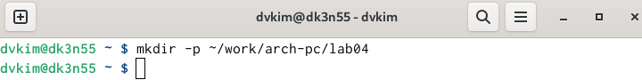{#fig:001 width=70%}

Переходим в него, создаём текстовый файл hello.asm и открываем его с помощью gedit (рис. [-@fig:002]):

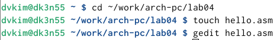{#fig:002 width=70%}

Вводим текст в файл (рис. [-@fig:003]):

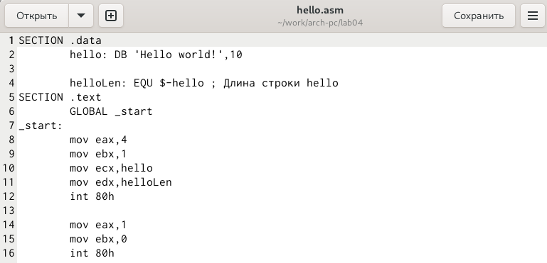{#fig:003 width=70%}

Вводим команды для компиляции текста. Проверяем правильность (рис. [-@fig:004]):

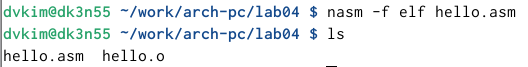{#fig:004 width=70%}

Выполняем следующую команду. Проверяем правильность: (рис. [-@fig:005]):

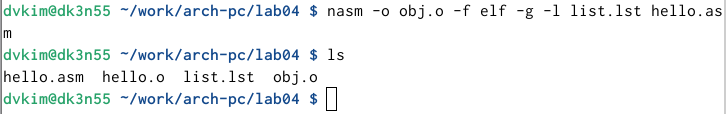{#fig:005 width=70%}

Передаём объектный файл на обработку компоновщику (рис. [-@fig:006]):

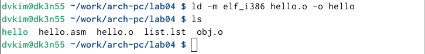{#fig:006 width=70%}

Ключ -o с последующим значением задаёт в данном случае имя создаваемого исполняе-
мого файла. Выполняем следующую команду: (рис. [-@fig:007]):

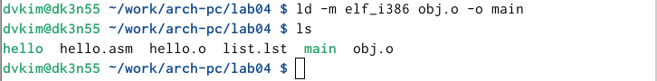{#fig:007 width=70%}

Запуск программы Hello (рис. [-@fig:008]):

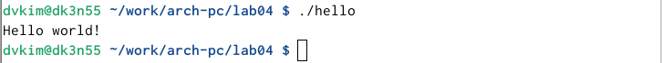{#fig:008 width=70%}

Выполняем задания для самостоятельной работы. В каталоге ~/work/arch-pc/lab04 с помощью команды cp создаем копию файла hello.asm с именем lab4.asm (рис. [-@fig:009]):

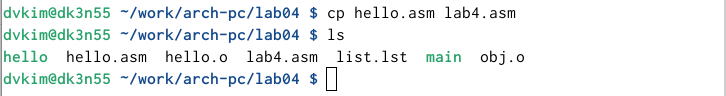{#fig:009 width=70%}

С помощью любого текстового редактора вносим изменения в текст программы в файле lab4.asm так, чтобы вместо Hello world! на экран выводилась строка с нашими фамилией и именем (рис. [-@fig:010]):

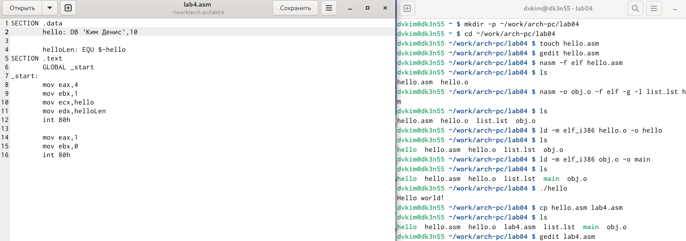{#fig:010 width=70%}

Оттранслируем полученный текст программы lab4.asm в объектный файл. Выполняем компоновку объектного файла и запускаем получившийся исполняемый файл (рис. [-@fig:011]):

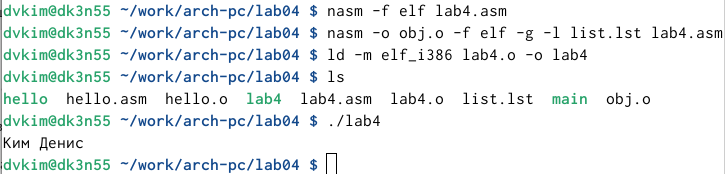{#fig:011 width=70%}

Копируем файлы hello.asm и lab4.asm в наш локальный репозиторий в каталог ~/work/study/2023-2024/"Архитектура компьютера"/arch-pc/labs/lab04/. (рис. [-@fig:012]):

{#fig:012 width=70%}

Загружаем файлы на Github. (рис. [-@fig:013]):

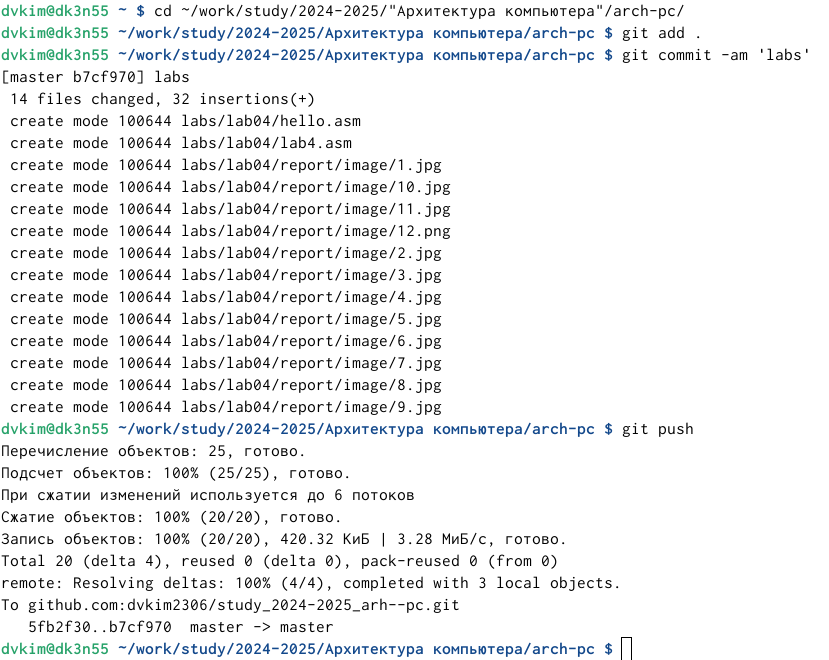{#fig:013 width=70%}

# Выводы

В ходе данной работы я освоил процедуры компиляции и сборки программ, написанных на ассемблере NASM. Теперь я могу вводить текст, транслировать и компоновать его, а также запускать программу (выводить текст) с помощью данного ассемблера.

# Список литературы{.unnumbered}

::: {#refs}
:::
