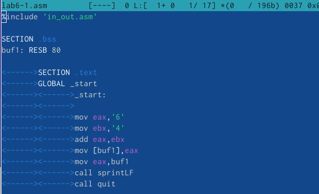
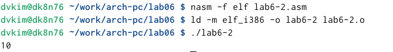

---
## Front matter
title: "Отчёт по лабораторной работе №6"
subtitle: "Дисциплина: Архитектура компьютера"
author: "Ким Денис Вячеславович"

## Generic otions
lang: ru-RU
toc-title: "Содержание"

## Bibliography
bibliography: bib/cite.bib
csl: pandoc/csl/gost-r-7-0-5-2008-numeric.csl

## Pdf output format
toc: true # Table of contents
toc-depth: 2
lof: true # List of figures
lot: true # List of tables
fontsize: 12pt
linestretch: 1.5
papersize: a4
documentclass: scrreprt
## I18n polyglossia
polyglossia-lang:
  name: russian
  options:
	- spelling=modern
	- babelshorthands=true
polyglossia-otherlangs:
  name: english
## I18n babel
babel-lang: russian
babel-otherlangs: english
## Fonts
mainfont: IBM Plex Serif
romanfont: IBM Plex Serif
sansfont: IBM Plex Sans
monofont: IBM Plex Mono
mathfont: STIX Two Math
mainfontoptions: Ligatures=Common,Ligatures=TeX,Scale=0.94
romanfontoptions: Ligatures=Common,Ligatures=TeX,Scale=0.94
sansfontoptions: Ligatures=Common,Ligatures=TeX,Scale=MatchLowercase,Scale=0.94
monofontoptions: Scale=MatchLowercase,Scale=0.94,FakeStretch=0.9
mathfontoptions:
## Biblatex
biblatex: true
biblio-style: "gost-numeric"
biblatexoptions:
  - parentracker=true
  - backend=biber
  - hyperref=auto
  - language=auto
  - autolang=other*
  - citestyle=gost-numeric
## Pandoc-crossref LaTeX customization
figureTitle: "Рис."
tableTitle: "Таблица"
listingTitle: "Листинг"
lofTitle: "Список иллюстраций"
lotTitle: "Список таблиц"
lolTitle: "Листинги"
## Misc options
indent: true
header-includes:
  - \usepackage{indentfirst}
  - \usepackage{float} # keep figures where there are in the text
  - \floatplacement{figure}{H} # keep figures where there are in the text
---

# Цель работы

Освоение арифметических инструкций языка ассемблера NASM.

# Задание

В процессе данной лабораторной работы мне предстоит познакомиться с арифметическими инструкциями языка ассемблера NASM и освоить работу с ними. 

# Теоретическое введение

Здесь описываются теоретические аспекты, связанные с выполнением работы.

Например, в табл. [-@tbl:std-dir] приведено краткое описание стандартных каталогов Unix.

: Описание некоторых каталогов файловой системы GNU Linux {#tbl:std-dir}

| Имя каталога | Описание каталога                                                                                                          |
|--------------|----------------------------------------------------------------------------------------------------------------------------|
| `/`          | Корневая директория, содержащая всю файловую                                                                               |
| `/bin `      | Основные системные утилиты, необходимые как в однопользовательском режиме, так и при обычной работе всем пользователям     |
| `/etc`       | Общесистемные конфигурационные файлы и файлы конфигурации установленных программ                                           |
| `/home`      | Содержит домашние директории пользователей, которые, в свою очередь, содержат персональные настройки и данные пользователя |
| `/media`     | Точки монтирования для сменных носителей                                                                                   |
| `/root`      | Домашняя директория пользователя  `root`                                                                                   |
| `/tmp`       | Временные файлы                                                                                                            |
| `/usr`       | Вторичная иерархия для данных пользователя                                                                                 |

Более подробно про Unix см. в [@tanenbaum_book_modern-os_ru; @robbins_book_bash_en; @zarrelli_book_mastering-bash_en; @newham_book_learning-bash_en].

# Выполнение лабораторной работы

Создаём каталог для программ лабораторной работы № 6, переходим в него и создаём файл lab6-1.asm: (рис. [-@fig:001]):

{#fig:001 width=70%}

Вводим в файл lab6-1.asm текст программы из листинга 6.1.: (рис. [-@fig:002]).

{#fig:002 width=70%}

Запускаем файл: (рис. [-@fig:003]).

{#fig:003 width=70%}

Изменяем текст программы, как задано в условии. При его запуске на выход идёт пустая строка: (рис. [-@fig:004]).

{#fig:004 width=70%}

Создаём файл lab6-2.asm в каталоге ~/work/arch-pc/lab06 и вводим в него текст программы из листинга 6.2. Далее запускаем его и получаем на выходе число 106: (рис. [-@fig:005]).

{#fig:005 width=70%}

Аналогично предыдущему примеру меняем символы на числа. Запускаем изменённый файл и получаем на выходе число 10. Если заменить функцию iprintLF на iprint, то отступа после вывода результата не будет: (рис. [-@fig:006]).

{#fig:006 width=70%}

В качестве примера выполнения арифметических операций в NASM приведем программу вычисления арифметического выражения f(x) = (5 ∗ 2 + 3)/3. Создаём новый файл и вводим в него заданный текст. Запускаем программу: (рис. [-@fig:007]).

{#fig:007 width=70%}

В качестве другого примера рассмотрим программу вычисления варианта задания по номеру студенческого билета, работающую по заданному алгоритму. Это делается в новом файле. Запускаем программу и вводим номер студенческого билета. Нам достался вариант 11: (рис. [-@fig:008]).

{#fig:008 width=70%}

Отвечаем на заданные вопросы:

1. mov eax,rem; call sprint
2. Для записи длины вводимого сообщения
3. Для перевода ASCII кода в число
4. Начиная с xor edx,edx и заканчивая inc edx
5. В регистр eax
6. Для увеличения операнда на единицу
7. mov eax,edx; call iprintLF

Выполняем задания для самостоятельной работы. Напишем программу вычисления выражения y = f(x). Нам достался 11 вариант, поэтому пишем программу для вычисления функции f(x) = 10(x + 1) − 10. После этого вводим заданные значения: (рис. [-@fig:009]).

{#fig:009 width=70%}

# Выводы

В ходе данной работы я освоил работу с арифметическими инструкциями языка ассемблера NASM. Кроме того, я научился писать собственные программы для вычисления функций с неизвестными переменными.

# Список литературы{.unnumbered}

::: {#refs}
:::
