---
## Front matter
title: "Отчёт по лабораторной работе №7"
subtitle: "Дисциплина: Архитектура компьютера"
author: "Ким Денис Вячеславович"

## Generic otions
lang: ru-RU
toc-title: "Содержание"

## Bibliography
bibliography: bib/cite.bib
csl: pandoc/csl/gost-r-7-0-5-2008-numeric.csl

## Pdf output format
toc: true # Table of contents
toc-depth: 2
lof: true # List of figures
lot: true # List of tables
fontsize: 12pt
linestretch: 1.5
papersize: a4
documentclass: scrreprt
## I18n polyglossia
polyglossia-lang:
  name: russian
  options:
	- spelling=modern
	- babelshorthands=true
polyglossia-otherlangs:
  name: english
## I18n babel
babel-lang: russian
babel-otherlangs: english
## Fonts
mainfont: IBM Plex Serif
romanfont: IBM Plex Serif
sansfont: IBM Plex Sans
monofont: IBM Plex Mono
mathfont: STIX Two Math
mainfontoptions: Ligatures=Common,Ligatures=TeX,Scale=0.94
romanfontoptions: Ligatures=Common,Ligatures=TeX,Scale=0.94
sansfontoptions: Ligatures=Common,Ligatures=TeX,Scale=MatchLowercase,Scale=0.94
monofontoptions: Scale=MatchLowercase,Scale=0.94,FakeStretch=0.9
mathfontoptions:
## Biblatex
biblatex: true
biblio-style: "gost-numeric"
biblatexoptions:
  - parentracker=true
  - backend=biber
  - hyperref=auto
  - language=auto
  - autolang=other*
  - citestyle=gost-numeric
## Pandoc-crossref LaTeX customization
figureTitle: "Рис."
tableTitle: "Таблица"
listingTitle: "Листинг"
lofTitle: "Список иллюстраций"
lotTitle: "Список таблиц"
lolTitle: "Листинги"
## Misc options
indent: true
header-includes:
  - \usepackage{indentfirst}
  - \usepackage{float} # keep figures where there are in the text
  - \floatplacement{figure}{H} # keep figures where there are in the text
---

# Цель работы

Изучить команды условного и безусловного переходов, приобрести навыки написания программ с использованием переходов и познакомиться с назначением и структурой файла листинга.

# Задание

В ходе данной работы мне предстоит познакомиться с командами условного и безусловного перехода, прибрести навыки работы с ними изучить структуры файлов листинга, а также написать программы для выполнения заданий.

# Теоретическое введение

Здесь описываются теоретические аспекты, связанные с выполнением работы.

Например, в табл. [-@tbl:std-dir] приведено краткое описание стандартных каталогов Unix.

: Описание некоторых каталогов файловой системы GNU Linux {#tbl:std-dir}

| Имя каталога | Описание каталога                                                                                                          |
|--------------|----------------------------------------------------------------------------------------------------------------------------|
| `/`          | Корневая директория, содержащая всю файловую                                                                               |
| `/bin `      | Основные системные утилиты, необходимые как в однопользовательском режиме, так и при обычной работе всем пользователям     |
| `/etc`       | Общесистемные конфигурационные файлы и файлы конфигурации установленных программ                                           |
| `/home`      | Содержит домашние директории пользователей, которые, в свою очередь, содержат персональные настройки и данные пользователя |
| `/media`     | Точки монтирования для сменных носителей                                                                                   |
| `/root`      | Домашняя директория пользователя  `root`                                                                                   |
| `/tmp`       | Временные файлы                                                                                                            |
| `/usr`       | Вторичная иерархия для данных пользователя                                                                                 |

Более подробно про Unix см. в [@tanenbaum_book_modern-os_ru; @robbins_book_bash_en; @zarrelli_book_mastering-bash_en; @newham_book_learning-bash_en].

# Выполнение лабораторной работы

Создаём каталог для программ лабораторной работы № 7, переходим в него и создаём файл lab7-1.asm: (рис. [-@fig:001]).

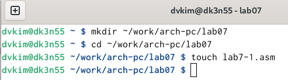{#fig:001 width=70%}

Рассмотрим пример программы с использованием инструкции jmp. Вводим файл lab7-1.asm текст программы из листинга 7.1.: (рис. [-@fig:002]).

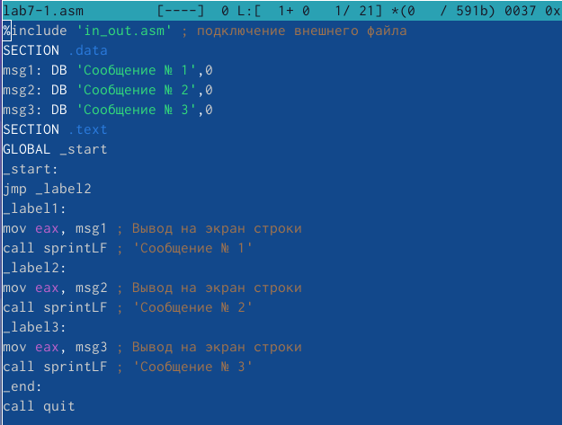{#fig:002 width=70%}

Создаём исполняемый файл и запускаем его. : (рис. [-@fig:003]).

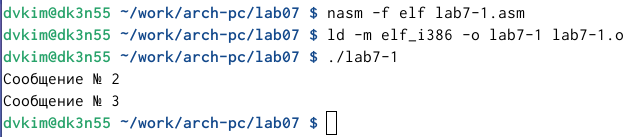{#fig:003 width=70%}

Изменяем текст программы в соответствии с листингом 7.2.: (рис. [-@fig:004]).

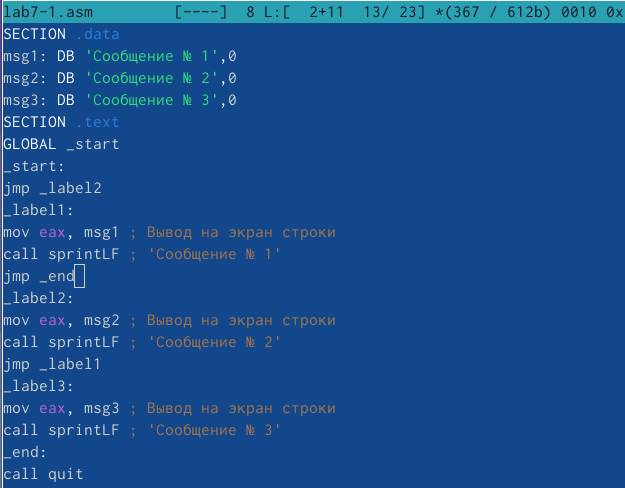{#fig:004 width=70%}

Проверяем работу файла: (рис. [-@fig:005]).

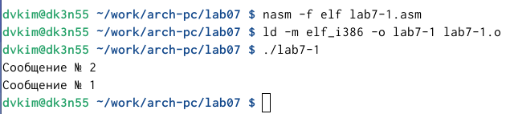{#fig:005 width=70%}

Изменяем текст программы добавив или изменив инструкции jmp так, чтобы вывод программы был как в условии: (рис. [-@fig:006]).

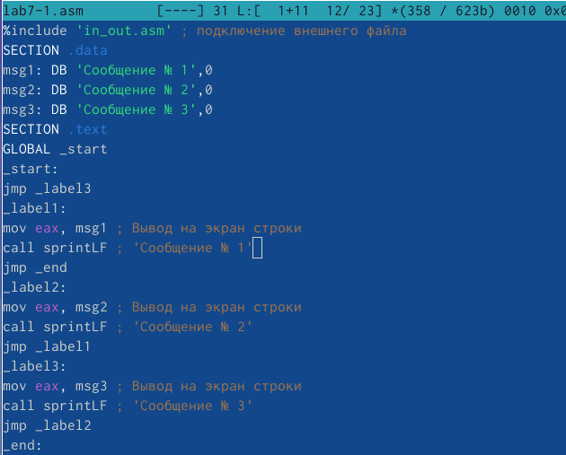{#fig:006 width=70%}

Проверяем программу: (рис. [-@fig:007]).

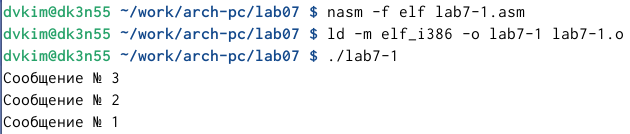{#fig:007 width=70%}

В качестве примера рассмотрим программу, которая определяет и выводит на экран наибольшую из 3 целочисленных переменных: A,B и C. Значения для A и C задаются в программе, значение B вводится с клавиатуры.
Создаём файл lab7-2.asm в каталоге ~/work/arch-pc/lab07. Внимательно изучаем текст программы из листинга 7.3 и вводим в lab7-2.asm.: (рис. [-@fig:008]).

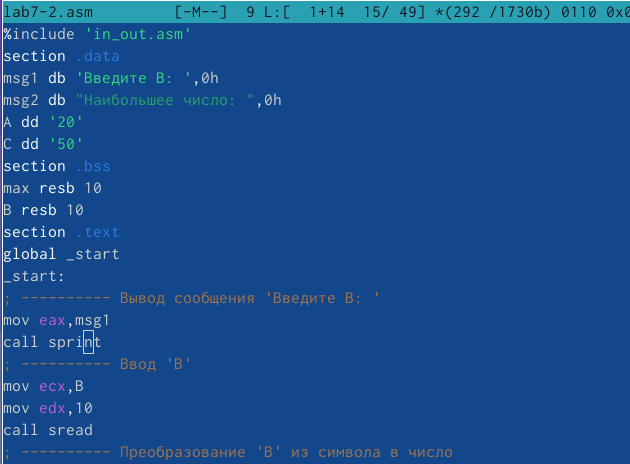{#fig:008 width=70%}

Проверяем работу на различных значениях B, например, 3: (рис. [-@fig:009]).

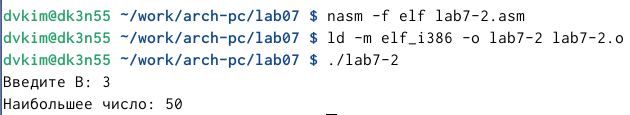{#fig:009 width=70%}

Создаём файл листинга для программы из файла lab7-2.asm. Открываем его с помощью mcedit и изучаем его.
000000E8 B8[00000000]            mov eax,msg1
000000ED E81DFFFFFF              call sprint - эти строки отвечают за вывод сообщения 'Введите B: '

000000F2 B9[0A000000]            mov ecx,B
18 000000F7 BA0A000000           mov edx,10
19 000000FC E842FFFFFF           call sread - эти строки отвечают за приём введеного с клавиатуры значения

0000016D E869FFFFFF              call quit - эта строка отвечает за выход из программы

Удалим один операнд в любой инструкции с двумя операндами: (рис. [-@fig:010]).

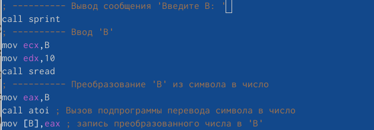{#fig:010 width=70%}

В таком случае мы получаем ошибку, которая появляется в листинге: (рис. [-@fig:011]).

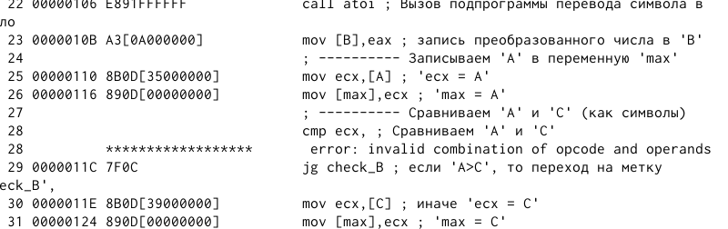{#fig:011 width=70%}

Выполняем задания для самостоятельной работы. Напишем программу нахождения наименьшей из 3 целочисленных переменных a, b, c. Значения переменных выберем из таблицы в соответствии с вариантом, полученным при выполнении лабораторной работы № 6 (у нас был 11 вариант). Создаём исполняемый файл и проверяем его работу: (рис. [-@fig:012]).

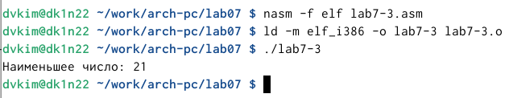{#fig:012 width=70%}

Напишем программу, которая для введенных с клавиатуры значений x и a вычисляет значение заданной функции f(x) и выводит результат вычислений. Вид функции f(x) выбираем из таблицыи вариантов заданий в соответствии с вариантом, полученным при выполнении лабораторной работы № 6. Создаём исполняемый файл и проверяем его работу для значений x и a из 7.6.: (рис. [-@fig:013]).

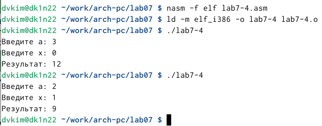{#fig:013 width=70%}

# Выводы

В ходе данной работы я изучил команды условного и безусловного переходов, приобрёл навыки написания программ с использованием переходов и познакомился с назначением и структурой файла листинга. Кроме того, я научился писать собственные программы для выполения различных математических задач.

# Список литературы{.unnumbered}

::: {#refs}
:::
