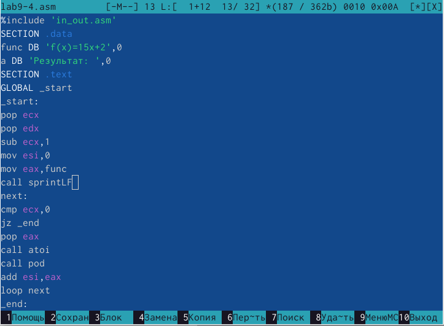

---
## Front matter
title: "Отчёт по лабораторной работе №9"
subtitle: "Дисциплина: Архитектура компьютера"
author: "Ким Денис Вячеславович"

## Generic otions
lang: ru-RU
toc-title: "Содержание"

## Bibliography
bibliography: bib/cite.bib
csl: pandoc/csl/gost-r-7-0-5-2008-numeric.csl

## Pdf output format
toc: true # Table of contents
toc-depth: 2
lof: true # List of figures
lot: true # List of tables
fontsize: 12pt
linestretch: 1.5
papersize: a4
documentclass: scrreprt
## I18n polyglossia
polyglossia-lang:
  name: russian
  options:
	- spelling=modern
	- babelshorthands=true
polyglossia-otherlangs:
  name: english
## I18n babel
babel-lang: russian
babel-otherlangs: english
## Fonts
mainfont: IBM Plex Serif
romanfont: IBM Plex Serif
sansfont: IBM Plex Sans
monofont: IBM Plex Mono
mathfont: STIX Two Math
mainfontoptions: Ligatures=Common,Ligatures=TeX,Scale=0.94
romanfontoptions: Ligatures=Common,Ligatures=TeX,Scale=0.94
sansfontoptions: Ligatures=Common,Ligatures=TeX,Scale=MatchLowercase,Scale=0.94
monofontoptions: Scale=MatchLowercase,Scale=0.94,FakeStretch=0.9
mathfontoptions:
## Biblatex
biblatex: true
biblio-style: "gost-numeric"
biblatexoptions:
  - parentracker=true
  - backend=biber
  - hyperref=auto
  - language=auto
  - autolang=other*
  - citestyle=gost-numeric
## Pandoc-crossref LaTeX customization
figureTitle: "Рис."
tableTitle: "Таблица"
listingTitle: "Листинг"
lofTitle: "Список иллюстраций"
lotTitle: "Список таблиц"
lolTitle: "Листинги"
## Misc options
indent: true
header-includes:
  - \usepackage{indentfirst}
  - \usepackage{float} # keep figures where there are in the text
  - \floatplacement{figure}{H} # keep figures where there are in the text
---

# Цель работы

Приобрести навыки написания программ с использованием подпрограмм и познакомиться с методами отладки при помощи GDB и его основными возможностями.

# Задание

В ходе данной работы мне предстоит познакомиться с понятием отладки, методами отладки, основными возможностями отладчика GDB. Также я научусь пользоваться отладкой программ с помощью данного отладчика.

# Теоретическое введение

Здесь описываются теоретические аспекты, связанные с выполнением работы.

Например, в табл. [-@tbl:std-dir] приведено краткое описание стандартных каталогов Unix.

: Описание некоторых каталогов файловой системы GNU Linux {#tbl:std-dir}

| Имя каталога | Описание каталога                                                                                                          |
|--------------|----------------------------------------------------------------------------------------------------------------------------|
| `/`          | Корневая директория, содержащая всю файловую                                                                               |
| `/bin `      | Основные системные утилиты, необходимые как в однопользовательском режиме, так и при обычной работе всем пользователям     |
| `/etc`       | Общесистемные конфигурационные файлы и файлы конфигурации установленных программ                                           |
| `/home`      | Содержит домашние директории пользователей, которые, в свою очередь, содержат персональные настройки и данные пользователя |
| `/media`     | Точки монтирования для сменных носителей                                                                                   |
| `/root`      | Домашняя директория пользователя  `root`                                                                                   |
| `/tmp`       | Временные файлы                                                                                                            |
| `/usr`       | Вторичная иерархия для данных пользователя                                                                                 |

Более подробно про Unix см. в [@tanenbaum_book_modern-os_ru; @robbins_book_bash_en; @zarrelli_book_mastering-bash_en; @newham_book_learning-bash_en].

# Выполнение лабораторной работы

Создаём каталог для выполнения лабораторной работы № 9, переходим в него и создаём файл lab9-1.asm: (рис. [-@fig:001]).

{#fig:001 width=70%}

В качестве примера рассмотрим программу вычисления арифметического выражения f(x) = 2x + 7 с помощью подпрограммы _calcul. Изучаем его(рис. [-@fig:002]).

{#fig:002 width=70%}

Проверяем работу файла: (рис. [-@fig:003]).

{#fig:003 width=70%}

Изменяем текст программы, добавив подпрограмму _subcalcul в подпрограмму _calcul:(рис. [-@fig:004]).

{#fig:004 width=70%}

Проверяем работу файла программы с внесёнными изменениями: (рис. [-@fig:005]).

{#fig:005 width=70%}

Создаём файл lab09-2.asm с текстом программы из Листинга 9.2. (Программа печати сообщения Hello world!). Загружаем исполняемый файл в отладчик gdb: (рис. [-@fig:006]).

{#fig:006 width=70%}

Проверяем работу программы, запустив ее в оболочке GDB с помощью команды run: (рис. [-@fig:007]).

{#fig:007 width=70%}

Для более подробного анализа программы устанавливаем брейкпоинт на метку _start, с которой начинается выполнение любой ассемблерной программы, и запускаем её. (рис. [-@fig:008]).

{#fig:008 width=70%}

Посмотрим дисассимилированный код программы с помощью команды disassemble, начиная с метки _start (рис. [-@fig:009]).

{#fig:009 width=70%}

Переключаемся на отображение команд с Intel’овским синтаксисом, введя команду set disassembly-flavor intel. Отличия состоят в том, что в дисассимилированном отображении используются % и $, Intel их не использует: (рис. [-@fig:010]).

{#fig:010 width=70%}

Включаем режим псевдографики для более удобного анализа программы (рис. 9.2): (рис. [-@fig:011]).

{#fig:011 width=70%}

На предыдущих шагах была установлена точка останова по имени метки (_start). Проверяем это с помощью команды info breakpoints: (рис. [-@fig:012]).

{#fig:012 width=70%}

Установим еще одну точку останова по адресу инструкции. Определяем адрес предпоследней инструкции (mov ebx,0x0) и устанавливаем точку останова: (рис. [-@fig:013]).

{#fig:013 width=70%}

Посмотрим информацию о всех установленных точках останова: (рис. [-@fig:014]).

{#fig:014 width=70%}

Выполняем 5 инструкций с помощью команды stepi (или si) и проследим за изменением значений регистров. (рис. [-@fig:015]).

{#fig:015 width=70%}

Посмотреть содержимое регистров также можно с помощью команды info registers: (рис. [-@fig:016]).

{#fig:016 width=70%}

Посмотрите значение переменной msg1 по имени: (рис. [-@fig:017]).

{#fig:017 width=70%}

Посмотрим значение переменной msg2 по адресу. Адрес переменной можно определить по дизассемблированной инструкции. В данном случае я просмотрел значение переменной по имени. (рис. [-@fig:018]).

{#fig:018 width=70%}

Изменяем первый символ переменной msg1 (рис. 9.5): (рис. [-@fig:019]).

{#fig:019 width=70%}

Заменяем любой символ во второй переменной msg2: (рис. [-@fig:020]).

{#fig:020 width=70%}

Выводим в различных форматах (в шестнадцатеричном формате, в двоичном формате и в символьном виде) значение регистра edx: (рис. [-@fig:021]).

{#fig:021 width=70%}

С помощью команды set изменяем значение регистра ebx. Разница состоит в том, что команда выводит два разных значания, значения разнятся, так как в первый раз вносится значение 2, а второй регистр равен двум: (рис. [-@fig:022]).

{#fig:022 width=70%}

Завершаем выполнение программы с помощью команды continue и выходим из GDB с помощью команды quit  (рис. [-@fig:023]).

{#fig:023 width=70%}

Скопируем файл lab8-2.asm, созданный при выполнении лабораторной работы №8: (рис. [-@fig:024]).

{#fig:024 width=70%}

Создаём исполняемый файл. (рис. [-@fig:025]).

{#fig:025 width=70%}

Загружаем исполняемый файл в отладчик, указав заданные аргументы. Для начала установим точку останова перед первой инструкцией в программе и запустим её: (рис. [-@fig:026]).

{#fig:026 width=70%}

Адрес вершины стека храниться в регистре esp и по этому адресу располагается число, равное количеству аргументов командной строки. Посмотрим остальные позиции стека – по адресу [esp+4] располагается адрес в памяти, где находится имя программы, по адесу [esp+8] хранится адрес первого аргумента, по адресу [esp+12] – второго и т.д. Элементы расположены с интервалом в 4, так как стек может хранить до 4 байт: (рис. [-@fig:027]).

{#fig:027 width=70%}

Выполняем задания для самомстоятельной работы. Преобразуем программу из лабораторной работы №8, реализовав вычисление значения функции f(x) как подпрограмму: (рис. [-@fig:028]).

{#fig:028 width=70%}

Проверяем правильность: (рис. [-@fig:029]).

{#fig:029 width=70%}

В листинге 9.3 приведена программа вычисления выражения (3 + 2) ∗ 4 + 5. При запуске данная программа дает неверный результат - выражение равно 25, но программа выдаёт 10: (рис. [-@fig:030]).

{#fig:030 width=70%}

Запускаем отладчик и анализируем: (рис. [-@fig:031]).

{#fig:031 width=70%}

Исправляем ошибки в регистрах (например, в одной строчке они перепутаны): (рис. [-@fig:032]).

{#fig:032 width=70%}

Запускаем программу и получаем правильный ответ: (рис. [-@fig:033]).

{#fig:033 width=70%}

# Выводы

В ходе данной работы я приобрёл навыки написания программ с использованием подпрограмм и познакомился с методами отладки при помощи GDB и его основными возможностями.

# Список литературы{.unnumbered}

::: {#refs}
:::
